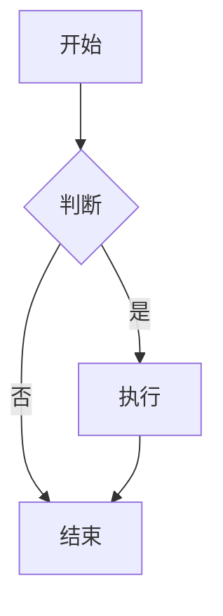
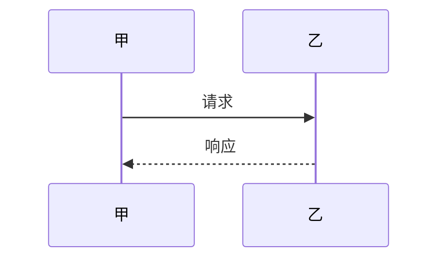

# 图表测试

下面是一个流程图，应当渲染成图：


```mermaid
graph TD
    A[开始] --> B{判断}
    B -->|是| C[执行]
    B -->|否| D[结束]
    C --> D
```

下面是一个时序图：


```mermaid
sequenceDiagram
    participant 甲
    participant 乙
    甲->>乙: 请求
    乙-->>甲: 响应
```

这段语法是错的，应当显示错误提示与源码，而不是白屏或崩溃：

```mermaid
graph TD
    A[未闭合
```

普通的代码块不受影响：

```js
const 甲 = 1
```
